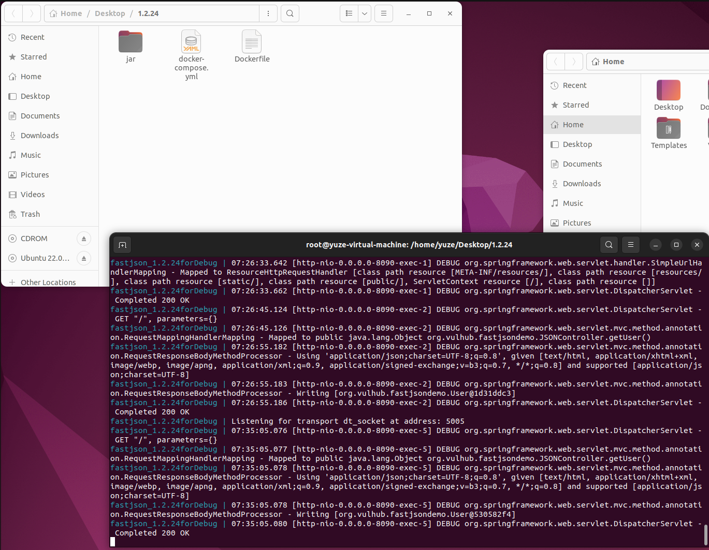
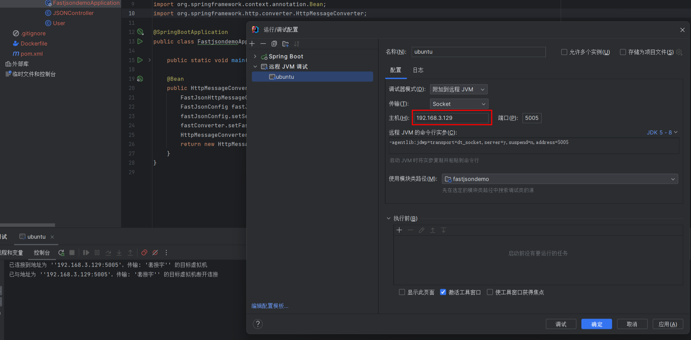
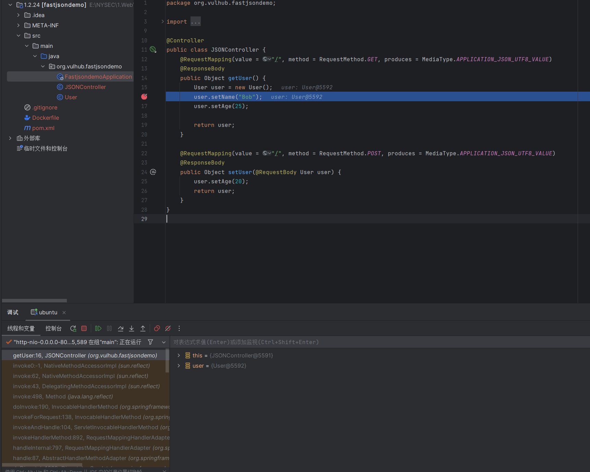

# Vulhub-For-DebugJavaVul
A project to debug java vulnerabilities easily


# 演示

和vulhub一样，进入对应文件夹，直接	

```
docker-compose up
```



进入 base 目录对应漏洞的源码文件夹，IDEA打开项目，配置远程JVM调试即可。



直接浏览器访问，本地下断点即可拦截




